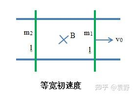
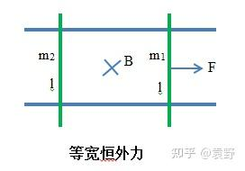
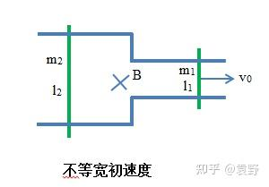
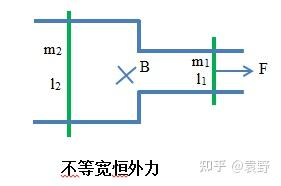

双杆问题一直是高中物理电磁学板块的一个常见的考点。由于其涉及到多物体的运动状态分析，难度较一般的单杆问题较高，其主要特点是经常涉及到动量定理以及动量守恒的运用。本文将双杆问题拆解为四个常见的模型：给定初速度还是恒外力，以及两杆是否等宽，并逐个对其分析得到一些高中范围内可求解的物理量。（事实上，任意物理量都是可解的，本文不涉及）。

**主要思路**：分析最终状态，找到一些物理量的关系 $\rightarrow$ 通过这些关系来分析过程（常用动量定理） $\rightarrow$ 计算得到其它物理量。

## 类型一 给定一杆初速度 $v_0$，两杆等宽

> 注：图源自知乎 [@袁野](https://www.zhihu.com/people/chen-zhou-73-29)

### 分析最终状态

这里我们注意到，由于水平方向上，两杆组成的系统不受其它外力（安培力是内力），故两杆最后必定共速，我们可以直接通过动量守恒解出末速度与初速度的关系：

$$
m_1v_0 = m_1v'+m2v' \Rightarrow v'=\frac{m_1}{m_1+m_2}v_0
$$

这样我们就可以通过末速度 $v'$ 来求解其它物理量了。

### 求整个过程产生的焦耳热 $Q$

通过能量守恒可以直接求出：

$$
Q = \frac{1}{2}m_1v_0^2-\left(\frac{1}{2}m_1v'^2+\frac{1}{2}m_2v'^2\right)
$$

### 求整个过程流经导体杆横截面电荷量 $q$

这里我们只对一根杆进行动量定理就足够了，这里我们以 2 杆为例（无初速度），当然 1 杆也是一样的。

$$
m_2v'-0 = B\bar{I}L\Delta{t} \Rightarrow q = \frac{m_2v'}{BL}
$$

### 求两根杆相对位移 $\Delta{x}$

这里有一个二级结论：$q = \dfrac{\Delta{\Phi}}{R}$，下面是证明过程：

$$
q = \bar{I}\Delta{t} = \frac{\bar{E}}{R}\Delta{t} = \frac{\bar{v}BL}{R}\Delta{t} = \frac{BLx}{R} = \frac{\Delta{\Phi}}{R}
$$

那么我们根据上面得到的 $q$，直接套用这个二级结论，即有：

$$
q = \frac{m_2v'}{BL} \equiv \frac{\Delta{\Phi}}{R} = \frac{BL\Delta{x}}{R_1+R_2} \Rightarrow \Delta{x} = \frac{m_2v'(R_1+R_2)}{B^2L^2}
$$

这里可能有细心的小伙伴会疑惑为什么双杆的 $\Delta{\Phi} = BL\Delta{x}$？其实也很好证明：

$$
\Delta{\Phi_1} = BLx_1, \Delta{\Phi_2} = BLx_2, \\
q = I\Delta{t} = \frac{\delta{E}}{R_1+R_2}\Delta{t},\left(\delta{E} = E_2-E_1 = 
\frac{BL(x_2-x_1)}{\Delta{t}}\right), \\
\Rightarrow q = \frac{BL(x_2-x_1)}{R_1+R_2} = \frac{BL\Delta{x}}{R_1+R_2}
$$

## 类型二 给定一杆恒外力 $F_0$，两杆等宽

### 分析最终状态

这里有一个结论：若一杆受恒外力 $F_0$，两杆最终加速度必定相同（即杆中电流恒定）。

$$
\begin{cases}
  {ma_1}^{\downarrow} = F-{F_{i1}}^{\uparrow}, \\
  {ma_2}^{\uparrow} = {F_{i_2}}^{\uparrow}
\end{cases}
$$

怎么理解呢，我们可以将两根杆视为一个整体（将安培力的相互作用想象成两杆中间有一根弹簧），这样也就不难得出：

$$
a' = \frac{F_0}{m_1+m_2}
$$

### 最终电流 $I$

我们之前说到过，最终状态电流恒定，原因是两杆的电势差恒定了 $(\delta{E} \propto v_2-v_1)$。要求电流 $I$ 的值，对其中一根杆受力分析：

$$
F_i = \frac{m_2F_0}{m_1+m_2} = BIL \Rightarrow I = \frac{m_2F_0}{BL(m_1+m_2)}
$$

### 最终两杆所受的安培力大小 $F_i$

由于两杆的加速度相同，对两杆受力分析并联立有：

$$
\frac{F_0-F_i}{m_1} = \frac{F_i}{m_2} \Rightarrow F_i = \frac{m_2F_0}{m_1+m_2}
$$

## 类型三 给定一杆初速度 $v_0$，两杆不等宽

### 分析末状态

这里需要注意的是，在不等宽的情形下，动量不一定守恒（两杆所受安培力合理可能不为0），故我们可以换一种角度去思考这个问题。

回想我们前面两杆等宽的情况，末状态除了两杆末速度相同以外，还有那些特点？没错，电流为 0,也就是说两杆电势差相等。我们就以电势差相等为切入口去寻找隐含的物理量关系。

$$
v_2BL = v_1Bl \Rightarrow \frac{v_1}{v_2} = \frac{L}{l}
$$

注意到，两杆末速度大小的比值和两杆宽度的比值实际上是倒数关系。

接下来，我们再以流过两杆电荷量相等，列出动量定理方程组：

$$
\begin{cases}
  m_1v_1-m_1v_0 = -Blq, \\
  m_2v_2 = BLq
\end{cases}
$$

做商就可以得到，

$$
\frac{m_1v_1-m_1v_0}{m_2v_2} = -\frac{l}{L}
$$

这样就得到两杆末速度与初速度的关系了。

### 求整个过程产生的焦耳热 $Q$

和之前一样的思路，通过能量守恒有：

$$
Q = \frac{1}{2}m_1v_0^2-\left(\frac{1}{2}m_1v_1^2+\frac{1}{2}m_2v_2^2\right)
$$

### 求整个过程流经导体杆横截面电荷量 $q$

由于我们之前得到了这个方程组：

$$
\begin{cases}
  m_1v_1-m_1v_0 = -Blq, \\
  m_2v_2 = BLq
\end{cases}
$$

且 $v_1, v_2$ 已知，将其代回上方程组就可以解出了。

## 给定一杆恒外力 $F_0$，两杆不等宽

### 分析末状态

实际上，在这个模型里，最终杆内电流也是恒定的（电流恒定 $\neq$ 两杆加速度相同）。原因和两杆等宽类似，这里就不赘述了。

由于两杆电流恒定，即两杆电势差恒定：

$$
\frac{\text{d}}{\text{d}t}Blv_1 = \frac{\text{d}}{\text{d}t} BLv_2 \Rightarrow Bla_1 = BLa_2
$$

对两杆分别受力分析（牛二），有：

$$
\begin{cases}
  F_0-BIl = m_1a_1, \\
  BIL = m_2a_2
\end{cases}
$$

和上式联立，就可以得到两杆最终的加速度了：

$$
\begin{cases}
  a_1 = \dfrac{FL^2}{m_1L^2+m_2l^2}, \\
  a_2 = \dfrac{FlL}{m_1L^2+m_2l^2}
\end{cases}
$$

貌似其它物理量并不是非常好求。
